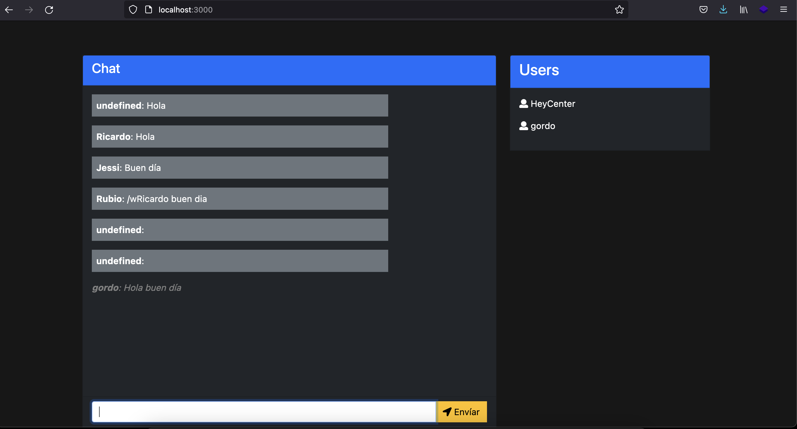

# Javascript Full Stack
Simple chat de JavaScript con tecnologias como NodeJS, SocketIO y MongoDb.
1. Descargar el proyecto
2. npm install
3. npm install mongoose
4. npm run dev
Podrás entrar a la sala de chat y asi poder mandar mensajes a todo el grupo que esta en el, pero si quieres mandar un mensaje privado tendras que poner el siguiente comando /w seguido del nombre de usuario y despues el mensaje que quieras mandarle en privado.
Ejemplo:
/w ricardo Nos podemos ver a las 7pm para platicar

# Tecnologías usadas
- Nodejs
  - Express
  - Socket.io
- Mongodb

# Links utilizados en este proyecto.
- [Bootstrap4 CDN](http://getbootstrap.com/docs/4.0/getting-started/introduction/)
- [Background Gradient Color](https://uigradients.com/#Lawrencium)
- [jQuery CDN](https://code.jquery.com/)
